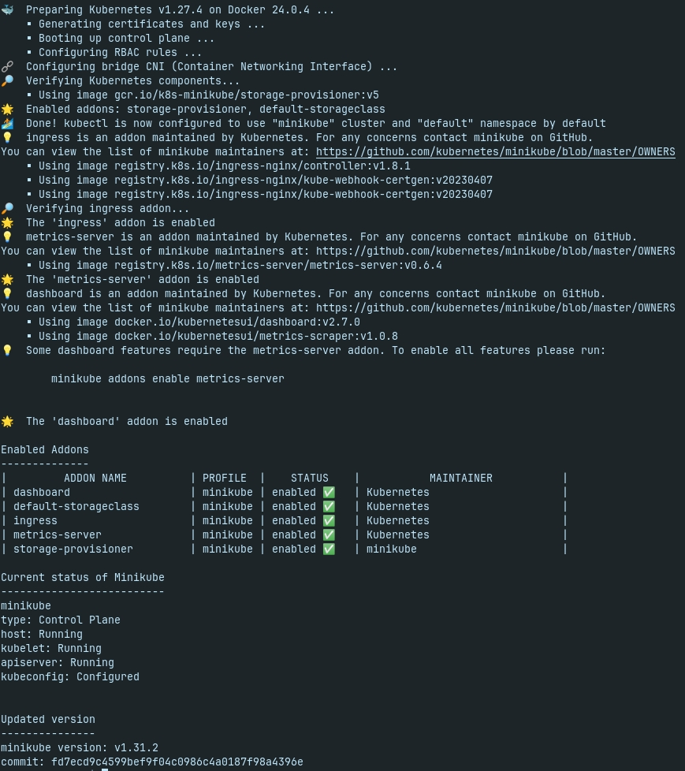

# Bash script samples

## 1. MySQL

- [mysql-create-db.sh](./mysql-create-db.sh): script create new database in server mysql/mariadb
- [update-minikube-linux.sh](./update-minikube-linux.sh): script update minikube to latest version on Linux machine
    
